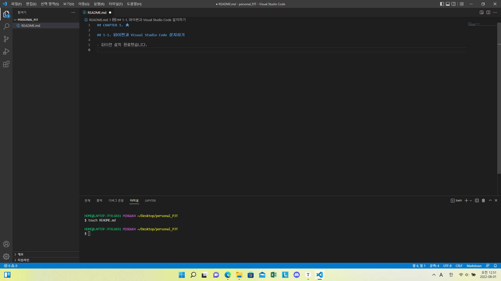

## CHAPTER 1. ★

## 1-1. 파이썬과 Visual Studio Code 설치하기

- 파이썬과 Visual Studio Code를 설치하고 실행한 과정을 나만의 글로 기록하기




```python
 우리가 파이썬을 왜 배워야 하는지에 대해, 파이썬은 왜 파이썬인지 간략하게 정리한 후에 Python을 설치해보았습니다.
설치부터 어려워 못하면 어떡하지 우려함과는 달리 Visual Studio Code라는 코드 에디터가 있어 손쉽게 할 수 있었습니다.
Python을 설치 후, 책에 있는 예제 문장을 실행해보며 맛을 보았습니다.
앞으로 어떤 것을 배울지 걱정 반, 기대 반 입니다.
```

### 1-2. 출력 프로그램 만들기

- 양식은 자유, 배운 내용을 최대한 활용하여 나를 소개하기

```python
print("2022", "07", "31", sep="-") # 2022-07-31
print("PM 23", "58", sep=":") # PM 23:58
print("------------") # ------------
print("내 이름은 최승은이고,", end=" ") # 내 이름은 최승은이고, 24살이다.
print("24살이다.")
print("MBTI는", "ISTP이다.") # MBTI는 ISTP이다.
```

### 1-3. 자료형 마스터!

- 문자열, 정수, 실수, 불 자료형 변수를 하나씩 만들고 type() 함수를 이용해 자료형으로 출력해 보기

```python
name = "최승은"
age = 24
MBTI = "ISTP"
height = 159.9
have_boyfriend = True
print(type(name)) # <class "str">
print(type(age)) # <class "int">
print(type(MBTI)) # <class "str">
print(height) # <class "float">
print(have_boyfriend) # <class "bool">
```

### 1-4. 어떻게 돈을 내야 할까?

- 언제나 딱 알맞은 금액으로 물건금액을 내고 싶은 승은이를 위해 1,000원 지폐, 100원 동전, 10원 동전이 최소한 몇 개씩 필요한지 계산하는 

  프로그램 만들어 보기

```python
price = 5670
thousand = 5
hundred = 6
ten = 7
print(f"""{price}원을 계산하려면 # 5670원을 계산하려면
1000원 지폐 {thousand}장 # 1000원 지폐 5장
100원 동전 {hundred}개 # 100원 동전 6개
10원 동전 {ten}개가 필요합니다.""") # 10원 동전 7개가 필요합니다.
```

### 1-5. 생년원일로 연도, 월, 일 출력하기

- 생년월일은 YYYYMMDD 형식의 숫자로 입력받은 뒤 연도, 월, 일을 계산해서 출력하는 프로그램 만들어 보기

```python
birth = int(input("생년월일을 입력해 주세요. : ")) # 19991006
year = birth // 10000
month = (birth % 10000) // 100
day = (birth % 10000) % 100
print(f"{year}년 {month}월 {day}일 생이네요!") # 1999년 10월 6일 생이네요!
```

### 1-6. 합격과 불합격 통보하기

- 세 과목의 점수를 입력받아 평균 점수가 50점 이상이면 '합격', 50점 미만이면 '불합격'을 출력하는 프로그램 만들어 보기

```PYTHON
score1 = int(input("국어 점수를 입력하세요. : "))
score2 = int(input("수학 점수를 입력하세요. : "))
score3 = int(input("영어 점수를 입력하세요. : "))
score4 = (score1 + score2 + score3) / 3

if score4 >= 50:
    print(f"평균 점수는 {score4}점으로 합격입니다.")
else:
    print(f"평균 점수는 {score4}점으로 불합격입니다.")
```

### 1-7. BMI 결과보기

- BMI = 몸무게(kg) / (키(m) * 키(m))

- 키와 몸무게를 입력받아 BMI 지수가 25 이상일 경우 '비만', 23 이상 25 미만일 경우 '과체중', 18.5 이상 23 미만일 경우 '정상 체중',

  18.5 미만일 경우에는 '저체중'이라는 메세지를 BMI 지수와 함께 출력하는 프로그램 만들어 보기

```PYTHON
height = int(input("키를 입력하세요. : "))
weight = int(input("몸무게를 입력하세요. : "))
bmi = weight / (height * 0.01 * height * 0.01)

if bmi >= 25:
    print(f"BMI 지수가 {bmi}이므로 비만입니다.")
elif bmi >= 23:
    print(f"BMI 지수가 {bmi}이므로 과체중입니다.")
elif bmi >= 18.5:
    print(f"BMI 지수가 {bmi}이므로 정상 체중입니다.")
else:
    print(f"BMI 지수가 {bmi}이므로 저체중입니다.")
```

### 1-8. 짝수이면서 7의 배수는 아닌 수 찾기

- 1 ~ 100 짝수들 중 7의 배수가 아닌 수가 몇 개인지 출력하는 프로그램 만들어 보기

```python
count = 0
for i in range(2, 101, 2):
    if i % 7 != 0:
        count += 1
print(f"짝수이면서 7의 배수가 아닌 수의 갯수는 {count}")
```

